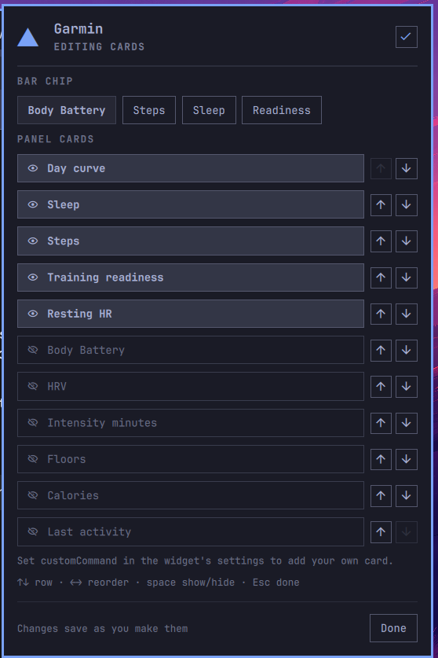

# Garmin for Omarchy

Today's Garmin health at a glance: **Body Battery** in the bar — or steps, sleep
or readiness, your pick — and a click-away panel of the metrics you care about.


---

## What it shows

**In the bar** — a glyph and one number. Body Battery by default; `barMetric`
switches it to steps, sleep score or training readiness, and the glyph follows.


The number is coloured by the reading, not by the plumbing: accent when it is
good news, urgent when it is bad news, plain in between. Body Battery and sleep
score use ≥ 60 / < 30, readiness ≥ 75 / < 35, and steps only ever go accent —
once you pass your goal. Being short of a step goal at 11am is not an emergency,
so steps have no urgent band at all. Anything degraded — stale data, an
unreachable API, a session that needs a new login — goes plain and dim, so a
broken helper never looks like a health alarm. A trailing `·` marks data that is
no longer fresh. Hover for a tooltip with the state, the last error (if any),
and the timestamp.

**In the panel** — a stack of cards, in the order `panelMetrics` asks for them:
the day's Body Battery and stress curve, sleep score and duration, steps against
your Garmin step goal, training readiness, resting HR, and more (full list under
[Settings](#settings)). A seven-day strip is drawn on the battery, sleep,
steps, readiness, resting HR, HRV and calories cards — hover a bar for that
day's value — and each day's steps bar is scaled against that day's own Garmin
goal; a `↗ ↘ →` delta is drawn on sleep, steps and resting HR. The rest of the
cards (curve, intensity, floors, activity, custom) show a figure only. Every
card gets a footer timestamp and a Refresh button.

**Click a card for its week.** Battery, sleep, steps, readiness, resting HR,
HRV and calories — and the day curve, which opens the week's **stress** — each
have a detail page: a full-width chart of the last seven days with a value
over every column, a hover tooltip per day, and a line of week statistics.
Sleep stacks deep/light/REM/awake, stress stacks rest/low/medium/high
minutes, calories stack resting under active, Body Battery draws each day's
low-to-high range, steps carry each day's own goal as a tick, and HRV shades
your balanced band. `Escape` or the arrow in the header goes back. Cards that
have no week behind them (intensity, floors, activity, custom) do not open.
The pencil in the header rearranges the whole deck without leaving the panel —
see [Rearranging the cards](#rearranging-the-cards-from-the-panel).

Deltas compare the **two newest cached entries that actually have that
field**, which is normally today against yesterday — but skips a day the
field is missing from rather than comparing against it. No arrow is shown if
those two entries are more than two days apart; an arrow against a reading
from last week is not a trend. Deltas and strips are drawn from cached
history, not from the live fetch, so a stale payload still shows you a real
comparison — just an older one; the footer's `· stale` is what tells you so.
Before your watch has synced for the day, today's own figures show `—`, while
the seven-day strips keep drawing from cache as usual.

That history is **re-fetched, not accumulated**. On the first successful fetch
of each calendar day — and on every manual refresh — the helper asks Garmin for
the whole trailing week, one ranged call per metric, and merges the answer over
what it already has: a real value always wins, and a day Garmin has nothing for
(or an endpoint that failed) leaves the cached number alone. A laptop that was
shut over the weekend therefore has no holes in its strips on Monday, and a
figure Garmin has since corrected is corrected here too. Every other poll that
day fetches today only.

**Interactions**

| Action | Result |
|---|---|
| Left click the chip | Open / close the panel — opening also retries a failed or stale fetch (a `live` state is left alone) |
| Left click a card | Open that metric's seven-day detail page (see above) |
| Arrow icon (panel header, detail page) | Back to the cards |
| Middle click the chip | Force a refresh — today's numbers and the whole week's history |
| Pencil icon (panel header) | Enter / leave edit mode |
| `Escape` (panel focused) | Leave the detail page, else leave edit mode, else close the panel |
| `e` (panel focused) | Enter / leave edit mode |
| `r` (panel focused) | Refresh today and the week (ignored while in edit mode) |
| `c` (panel focused) | Copy the suggested command to the clipboard (only when a guidance command is shown) |
| `↑ ↓` / `j` `k` (edit mode) | Walk the rows — arrow keys and their `j`/`k` equivalents work interchangeably |
| `← →` / `h` `l` (edit mode) | Reorder the current row (or pick the bar-chip metric on the top row) — arrow keys and their `h`/`l` equivalents work interchangeably |
| `space` / `Enter` (edit mode) | Show or hide the row — the two keys are equivalent |
| `Tab` / `Shift-Tab` (panel focused) | Switch to the next / previous bar-widget's panel (multi-monitor setups) |
| `omarchy-shell garmin refresh\|open\|close\|toggle` | Same, from a script or a keybind |
| `omarchy-shell garmin detail sleep` | Open the panel straight onto one metric's week (`battery`, `sleep`, `steps`, `readiness`, `rhr`, `hrv`, `calories`, or `curve` for stress) |

---

## Rearranging the cards from the panel



The pencil in the panel header opens **edit mode**, and everything about which
cards you see lives there — you never edit `shell.json` by hand:

- the **bar chip metric** as four chips at the top (Body Battery, Steps, Sleep,
  Readiness), the current one highlighted;
- every card below it with an **eye toggle** to show or hide it and **↑ ↓**
  arrows to move it. Hidden cards sink to the bottom of the list.

Changes apply the moment you make them — the panel behind re-renders and the
chip in the bar changes with it. `Escape`, the `Done` button, or the check icon
in the header leaves edit mode. From the keyboard: `↑ ↓` walks the rows, `← →`
reorders the row you are on (or picks the chip metric on the top row), and
`space` shows or hides. The last visible card cannot be turned off.

Edits are written by the helper to `~/.config/garmin-widget/prefs.json`
(`0600`, atomically replaced — QML never writes files itself), and they
**override** the `barMetric` and `panelMetrics` settings:

```
prefs.json  >  shell.json setting  >  built-in default
```

So the settings below are the starting point, and edit mode is the last word.
Delete `prefs.json` and the widget goes back to your `shell.json` settings —
but only after a shell restart (`omarchy restart shell`); it is not picked up
live.

---

## Your own card

`customCommand` puts anything you can print on the panel. The command runs on
the same cadence as the Garmin poll (and on every manual refresh), and must
print **one JSON object**:

```json
{"title": "Disk", "value": "888G free", "caption": "7% used",
 "meter": {"value": 7, "max": 100}, "tone": ""}
```

`title` and `value` are required; `caption`, `meter` and `tone` are optional.
`tone` is `accent`, `urgent` or empty — the same colours the health cards use.
A `meter` with a positive `max` draws the progress bar.

A worked example — free space on `/`, saved as `~/garmin-card-disk.sh` and
`chmod +x`:

```bash
#!/usr/bin/env bash
set -euo pipefail
read -r pct avail < <(df --output=pcent,avail -h / | tail -1)
pct=${pct%\%}; pct=${pct// /}
tone=""
[ "$pct" -ge 90 ] && tone="urgent"
printf '{"title":"Disk","value":"%s free","caption":"%s%% used","meter":{"value":%s,"max":100},"tone":"%s"}\n' \
  "$avail" "$pct" "$pct" "$tone"
```

Then set `customCommand` to `~/garmin-card-disk.sh` and turn the **Custom
command** row on in edit mode (it only appears once a command is set). Turning
that row off stops the command from running at all, not just from being drawn.

The card is deliberately unable to hurt the rest of the widget. It runs in its
own process with a **10-second timeout**, output over **8 KB** is ignored, and
anything that is not a well-formed object with a title and a value — garbage, a
hang, valid JSON of the wrong shape — simply **hides the card** and puts the
reason in the chip's tooltip, prefixed `custom card:`. What decides that is the
output, not the exit status: your command's own pipelines are none of the
widget's business, so a command that prints a good card is drawn whatever it
exits with, and a non-zero exit is only ever mentioned as extra detail on a
message the output had already earned. The Garmin fetch, the chip's number and
every other card carry on untouched. One caveat on
the timeout: it kills the `bash -c` your command line runs in, and — that being
how `bash -c` works — anything your command backgrounded or spawned into another
process group is left running, so write commands that finish on their own.

Two things it is not: it is not a shell you should put secrets in (the command
line sits in `shell.json` in plain text), and it is not a scheduler — a command
that takes seconds delays nothing, but it also does not get to run more often
than the poll interval.

---

## What's new in 0.4.0

- **Click a card for its week.** Every card with history behind it opens a
  full-width seven-day page: stacked sleep stages, stacked stress minutes,
  resting-under-active calories, Body Battery low-to-high ranges, steps with
  each day's goal tick, HRV against its balanced band, resting HR and
  readiness as plain bars — each with per-day labels, hover tooltips and a
  week summary. `Escape` or the header arrow returns.
  `omarchy-shell garmin detail <metric>` opens one from a keybind.
- **A week on every card.** The seven-day strip now sits under readiness,
  resting HR, HRV and calories as well as battery, sleep and steps, and the
  steps bars are scaled against each day's own goal. Hover a bar for the date
  and value.
- **History that heals.** The trailing week is re-fetched from Garmin's ranged
  endpoints on the first fetch of each day and on every manual refresh, then
  merged over the cache — so a closed laptop no longer leaves permanent gaps.
  Each row now carries steps and goal, sleep score, duration and stages,
  resting HR, HRV with its balanced band, Body Battery high/low/charged/
  drained, stress level and durations, calories, and readiness — the raw
  material for richer week views later. Later polls the same day still make
  exactly the calls they did before.
- Manual refreshes (middle-click, the panel button, `r`, the IPC call) fetch
  the week too and get a 120-second watchdog; the poller keeps its 45 seconds.

## What's new in 0.3.1

Fixes: `customCommand` runs via argv rather than a shell string, the custom
card's output is capped by content rather than by a fixed byte count, card
rows are height-equalized, the week view no longer breaks on an empty
morning, and screenshots/docs got a refresh.

## What's new in 0.3.0

- **Edit mode.** The pencil in the panel header turns the card list into a
  reorderable, toggleable list, with the bar chip's metric as a row of chips at
  the top. Changes apply live and persist in `prefs.json`, which overrides the
  matching settings.
- **A card of your own.** `customCommand` runs anything that prints a small JSON
  object and shows it as a card — it runs as your own user (no sandbox), bounded
  by a 10s timeout, an 8KB output cap and a defensive parser, so a broken script
  costs you that card and nothing else.
- **`prefs` subcommand.** `garmin-widget prefs get|set KEY VALUE` is the only
  writer of `prefs.json`; the panel calls it rather than touching disk itself.

## What's new in 0.2.0

- **The bar chip is yours to choose.** `barMetric` puts steps, sleep score or
  training readiness in the bar instead of Body Battery, with its own glyph and
  its own sensible threshold colours.
- **The panel is a deck of cards you order yourself.** `panelMetrics` picks from
  eleven metrics (twelve with `custom` since 0.3.0) — including a day-long Body
  Battery + stress curve, HRV status,
  weekly intensity minutes, floors, calories and your last activity — and shows
  them in the order you list.
- **Seven days of context.** Cards carry a seven-day strip and a `↗ ↘ →` delta
  against the previous cached day, kept in a small local history file.
- **More of your day fetched, none of it fatal.** Each new Garmin endpoint is
  asked for separately; one failing endpoint nulls its own card and never takes
  the rest of the panel down with it.

Existing settings keep working unchanged, and nothing about the failure states,
the tokens or the cache moved.

---

## Requirements

- **Omarchy** with the Quickshell-based bar (plugin schema v1).
- **Python 3** — the helper itself is stdlib-only, but the
  [`garminconnect`](https://github.com/cyberjunky/python-garminconnect) library
  it talks to requires **Python 3.12+**. Omarchy's system Python is newer than
  that, so this is normally already satisfied.
- **A Garmin Connect account.** No Garmin developer key is needed.
- **`wl-clipboard`** — for the panel's copy button. Usually already installed
  on Omarchy.

### External dependency: `garminconnect`

This plugin has one external dependency, and it is not installed for you.

Arch (and every other PEP 668 distro) refuses `pip install` into the system
Python, so the helper uses a **dedicated virtualenv** it knows how to find —
this is the same one-liner the panel shows (and its copy button copies) when
the dependency is missing:

```bash
python3 -m venv ~/.local/share/garmin-widget/venv && ~/.local/share/garmin-widget/venv/bin/pip install garminconnect==0.3.11
```

Verified against `garminconnect` **0.3.11**. Newer releases normally work — the
calls this plugin makes — `Garmin()`, `login()`, `get_user_summary()`,
`get_sleep_data()`, `get_body_battery()`, `get_stress_data()`,
`get_hrv_data()`, `get_training_readiness()`, `get_intensity_minutes_data()`,
`get_last_activity()` for today, and the ranged `get_daily_steps()`,
`get_rhr_daily()`, `get_sleep_daily()`, `get_body_battery(start, end)`,
`get_hrv_data_range()`, `get_calories_daily()` plus one raw `connectapi()`
call to the daily stress summary for the week — have been stable for a long
time, and each one is asked for separately so a renamed endpoint costs you a
card (or one field of the week) rather than the widget — but 0.3.11 is the
version the widget was tested on.

Nothing is installed system-wide, and nothing outside your home directory is
touched. The helper re-execs itself into that venv automatically when
`garminconnect` is not importable from the interpreter it started under — you
never have to activate anything.

Until the venv exists the bar chip shows the bolt glyph and an em dash,
dimmed, and the panel says
**HELPER DEPENDENCY MISSING**, with the one-liner above in a copyable box.

---

## Install

```bash
omarchy plugin add https://github.com/n1byn1kt/omarchy-garmin.git --enable
```

Then install the dependency (see above) and connect your account (below).

Updating later: `omarchy plugin update io.github.n1byn1kt.garmin`.

---

## Connect your Garmin account


Run the helper's `login` subcommand in a terminal:

```bash
~/.config/omarchy/plugins/io.github.n1byn1kt.garmin/bin/garmin-widget login
```

It prompts for your Garmin Connect email and password (the password is not
echoed), and for an **MFA code** if your account has multi-factor auth enabled —
MFA is fully supported, you just type the code when asked.

Two things worth knowing about the first login:

- **Garmin often rate-limits the first attempts.** You may see one or two lines
  like `mobile+cffi returned 429: GarminConnectTooManyRequestsError`. This is
  harmless — the library retries with a different login strategy internally, and
  the MFA path usually goes through right after. Let it finish.
- On success it prints one line of JSON:
  `{"ok": true, "tokens": "/home/you/.config/garmin-widget/tokens.json"}`.
  Give the bar up to `pollMinutes` to notice, or middle-click the chip to
  refresh immediately.

Only OAuth tokens are stored. Your password is never written to disk.

---

## Settings

Configured per bar-widget instance in Omarchy's bar settings (or in
`~/.config/omarchy/shell.json`):

| Setting | Type | Default | What it does |
|---|---|---|---|
| `pollMinutes` | number | `30` | How often the helper asks Garmin for new data. **Floored at 5 minutes**; `0` (or anything non-numeric) falls back to the 30-minute default instead of being floored — Garmin's numbers move slowly and polling harder mostly buys you rate limits. |
| `barMetric` | string | `bodyBattery` | Which number the bar chip carries: `bodyBattery`, `steps`, `sleep` (score) or `readiness` (training readiness). Case-insensitive; anything unrecognised falls back to `bodyBattery` rather than blanking the chip. The glyph changes with it. **Overridden by the panel's edit mode** (see [above](#rearranging-the-cards-from-the-panel)). |
| `showSteps` | boolean | `false` | Also show today's steps as a second figure in the bar (e.g. the bolt glyph and `61` followed by `8.0k`). Ignored when `barMetric` is `steps` — the same number twice is not worth the width. |
| `stepsGoalFallback` | number | `10000` | Step goal used in the panel when Garmin does not return one for the day. |
| `panelMetrics` | string | `curve,sleep,steps,readiness,rhr` | Which cards the panel shows, comma-separated. **The order you write is the order they appear.** Tokens: `curve` (Body Battery + stress for the day), `battery`, `sleep`, `steps`, `readiness`, `rhr`, `hrv`, `intensity` (weekly intensity minutes), `floors`, `calories`, `activity` (your last activity), `custom` (your own command — see [Your own card](#your-own-card)). Unknown tokens are skipped — a typo costs you one card, not the panel — and a card whose data Garmin did not return is left out. Past six visible cards the panel switches to a **dense layout**: the seven-day strips are dropped and metric cards pair up two to a row, to keep the panel a sane height. **Overridden by the panel's edit mode** (see [above](#rearranging-the-cards-from-the-panel)). |
| `customCommand` | string | `""` (off) | A command line whose stdout is one JSON object `{title, value, caption, meter:{value,max}, tone}`, rendered as the `custom` card. Empty means the card does not exist and nothing is ever run. See [Your own card](#your-own-card) for the contract and the safety rails. |

On a multi-monitor setup the widget appears on every bar, and it is designed so
that only **one** instance polls, fanning the result out to the others — one
Garmin session regardless of bar count. (Developed and verified on a
single-monitor setup; multi-monitor reports welcome.)

---

## Privacy

Your credentials go to Garmin only. Tokens are stored locally in
`~/.config/garmin-widget/` with 0600 permissions. The helper connects to Garmin
Connect only — no telemetry, no other hosts.

That Garmin-only claim is scoped to the **helper**. The plugin's QML runs
unsandboxed inside the shell process, with whatever access that process has,
and the helper — along with any `customCommand` you configure — runs as your
own user: a `customCommand` can reach anything your own scripts can reach. See
[Your own card](#your-own-card) for the safety rails around that.

Everything this plugin writes lives under your home directory:

| Path | Contents |
|---|---|
| `~/.config/garmin-widget/tokens.json` | Garmin OAuth tokens, mode `0600`. No password. |
| `~/.config/garmin-widget/prefs.json` | What you chose in the panel's edit mode — the card list and the bar metric, mode `0600`. Delete it to fall back to your `shell.json` settings. |
| `~/.cache/garmin-widget/last.json` | Last successful reading, so the bar can show yesterday's numbers while offline. |
| `~/.cache/garmin-widget/history.json` | Up to seven daily rows — steps and goal, sleep score, duration and stages, resting HR, HRV, Body Battery high/low/charged/drained, stress, calories, readiness — the source of the panel's strips and deltas. Re-fetched whole from Garmin's ranged endpoints on the first fetch of each day and on manual refresh (`windowFetchedOn` records when); other polls only update today's row. Older files are read and upgraded in place. |
| `~/.local/share/garmin-widget/venv/` | The dedicated virtualenv holding `garminconnect`. |

---

## Troubleshooting

The widget has five failure states, and each one asks you for exactly one thing.
Open the panel to see which you are in.

| Panel says | What happened | What to do |
|---|---|---|
| **HELPER DEPENDENCY MISSING** | `garminconnect` is not importable and no venv was found. | Run the one-liner under [External dependency](#external-dependency-garminconnect). |
| **NOT SIGNED IN** | No `~/.config/garmin-widget/tokens.json` yet. | Run `garmin-widget login` (path in the panel, copyable). |
| **SESSION EXPIRED** | Garmin rejected the stored tokens. | Run `garmin-widget login` again. Tokens do expire; this is normal every so often. |
| **OFFLINE** / **GARMIN API ERROR** | The network or Garmin Connect is unavailable. The specific error is shown. | Wait and hit Refresh. If a cached reading exists, the panel keeps showing it and marks the footer `· stale`. |
| Rows shown, footer `· stale` | Last fetch failed but a previous reading is cached. | Nothing — the numbers are real, just old. Refresh when you are back online. |

**Nothing appears in the bar at all.** Check the widget is enabled and placed:
`omarchy plugin list`. After enabling, `omarchy restart shell`.

**The chip shows the bolt glyph and an em dash, and never updates.** Run the helper by hand — it always
prints one JSON object and always exits 0, so the error is in the output:

```bash
~/.config/omarchy/plugins/io.github.n1byn1kt.garmin/bin/garmin-widget fetch
~/.config/omarchy/plugins/io.github.n1byn1kt.garmin/bin/garmin-widget status
```

**The shell dies right after you add or update the plugin.** Known upstream
issue, not fixed here: Quickshell 0.3.0 can segfault in
`IpcHandler::updateRegistration` when plugin files change underneath a shell
that is already restarting — which is exactly what `omarchy plugin add` and
`omarchy plugin update` do. We saw it in roughly 30% of rapid redeploy cycles
during development. It is always the **outgoing** process that dies; the
incoming one comes up clean, and the shell normally restarts itself. If it does
not:

```bash
omarchy restart shell
```

Your data is unaffected — nothing is lost but a few seconds of bar.

---

## Removal

```bash
omarchy plugin remove io.github.n1byn1kt.garmin
```

That removes the plugin only. Your tokens, prefs, cache and venv are
deliberately left behind, so removing and re-adding the plugin (or moving to a
newer version) does not make you log in again or lose your card layout. To
clear them out as well:

```bash
rm -rf ~/.config/garmin-widget ~/.cache/garmin-widget ~/.local/share/garmin-widget
```

---

## Development

```bash
python3 -m pytest tests/ -v          # helper unit tests, no network
omarchy plugin validate .            # manifest schema check
```

The plugin is `manifest.json`, `Service.qml` (poller and state machine),
`BarWidget.qml` (the chip), `Panel.qml` (the detail panel) with its
`MetricCard.qml` / `Meter.qml` / `CurveCard.qml` / `WeekView.qml` pieces, and the Python helper
in `bin/garmin-widget`. The helper's contract is that every
subcommand prints exactly one JSON object to stdout and exits 0 — errors are
data, never a non-zero exit, so a failed fetch can never blank the bar.

The Python side is covered by a pytest suite under `tests/`, run with
`python3 -m pytest tests/ -v` from the repo root.

## License

MIT — see [LICENSE](LICENSE).
