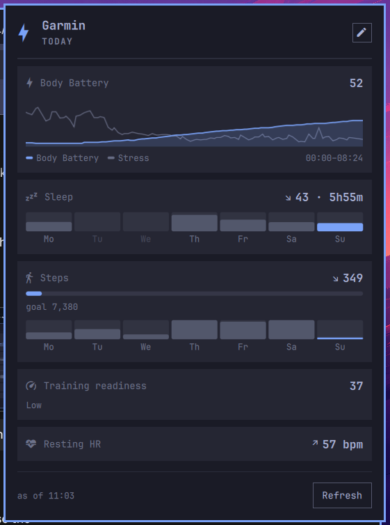
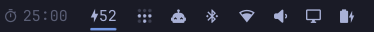
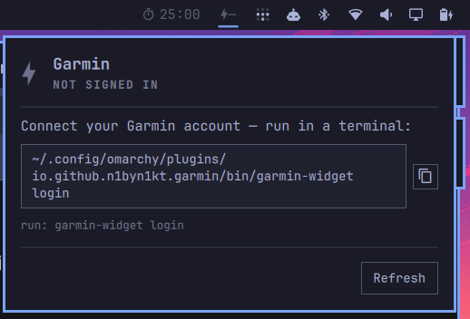

# Garmin for Omarchy

Today's Garmin health at a glance: **Body Battery** in the bar — or steps, sleep
or readiness, your pick — and a click-away panel of the metrics you care about.



---

## What it shows

**In the bar** — a glyph and one number. Body Battery by default; `barMetric`
switches it to steps, sleep score or training readiness, and the glyph follows.



The number is coloured by the reading, not by the plumbing: accent when it is
good news, urgent when it is bad news, plain in between. Body Battery and sleep
score use ≥ 60 / < 30, readiness ≥ 75 / < 35, and steps only ever go accent —
once you pass your goal. Being short of a step goal at 11am is not an emergency,
so steps have no urgent band at all. Anything degraded — stale data, an
unreachable API, a session that needs a new login — goes plain and dim, so a
broken helper never looks like a health alarm. A trailing `·` marks data that is
no longer fresh. Hover for a tooltip with the state, the last error (if any),
and the timestamp.

**In the panel** — a stack of cards, in the order `panelMetrics` asks for them:
the day's Body Battery and stress curve, sleep score and duration, steps against
your Garmin step goal, training readiness, resting HR, and more (full list under
[Settings](#settings)). Cards carry a seven-day strip and a `↗ ↘ →` delta where
the cache has the history for it, plus a footer timestamp and a Refresh button.

Deltas and strips compare the **two newest days in the local cache**, which is
normally today against yesterday. They are drawn from cached history, not from
the live fetch, so a stale payload still shows you a real comparison — just an
older one; the footer's `· stale` is what tells you so.

**Interactions**

| Action | Result |
|---|---|
| Left click the chip | Open / close the panel |
| Middle click the chip | Force a refresh |
| `Escape` (panel focused) | Close the panel |
| `r` (panel focused) | Refresh |
| `c` (panel focused) | Copy the suggested command to the clipboard |
| `qs ipc call garmin refresh\|open\|close\|toggle` | Same, from a script or a keybind |

---

## What's new in 0.2.0

- **The bar chip is yours to choose.** `barMetric` puts steps, sleep score or
  training readiness in the bar instead of Body Battery, with its own glyph and
  its own sensible threshold colours.
- **The panel is a deck of cards you order yourself.** `panelMetrics` picks from
  eleven metrics — including a day-long Body Battery + stress curve, HRV status,
  weekly intensity minutes, floors, calories and your last activity — and shows
  them in the order you list.
- **Seven days of context.** Cards carry a seven-day strip and a `↗ ↘ →` delta
  against the previous cached day, kept in a small local history file.
- **More of your day fetched, none of it fatal.** Each new Garmin endpoint is
  asked for separately; one failing endpoint nulls its own card and never takes
  the rest of the panel down with it.

Existing settings keep working unchanged, and nothing about the failure states,
the tokens or the cache moved.

---

## Requirements

- **Omarchy** with the Quickshell-based bar (plugin schema v1).
- **Python 3** — the helper itself is stdlib-only, but the
  [`garminconnect`](https://github.com/cyberjunky/python-garminconnect) library
  it talks to requires **Python 3.12+**. Omarchy's system Python is newer than
  that, so this is normally already satisfied.
- **A Garmin Connect account.** No Garmin developer key is needed.

### External dependency: `garminconnect`

This plugin has one external dependency, and it is not installed for you.

Arch (and every other PEP 668 distro) refuses `pip install` into the system
Python, so the helper uses a **dedicated virtualenv** it knows how to find:

```bash
python3 -m venv ~/.local/share/garmin-widget/venv
~/.local/share/garmin-widget/venv/bin/pip install garminconnect
```

Verified against `garminconnect` **0.3.11**. Newer releases normally work — the
calls this plugin makes (`Garmin()`, `login()`, `get_user_summary()`,
`get_sleep_data()`, `get_body_battery()`, `get_stress_data()`,
`get_hrv_data()`, `get_training_readiness()`, `get_intensity_minutes_data()`,
`get_last_activity()`) have been stable for a long time, and each one is asked
for separately so a renamed endpoint costs you a card rather than the widget —
but 0.3.11 is the version the widget was tested on.

Nothing is installed system-wide, and nothing outside your home directory is
touched. The helper re-execs itself into that venv automatically when
`garminconnect` is not importable from the interpreter it started under — you
never have to activate anything.

Until the venv exists the bar chip shows `⚡—` dimmed and the panel says
**HELPER DEPENDENCY MISSING**, with the two commands above in a copyable box.

---

## Install

```bash
omarchy plugin add https://github.com/n1byn1kt/omarchy-garmin.git --enable
```

Then install the dependency (see above) and connect your account (below).

Updating later: `omarchy plugin update io.github.n1byn1kt.garmin`.

---

## Connect your Garmin account



Run the helper's `login` subcommand in a terminal:

```bash
~/.config/omarchy/plugins/io.github.n1byn1kt.garmin/bin/garmin-widget login
```

It prompts for your Garmin Connect email and password (the password is not
echoed), and for an **MFA code** if your account has multi-factor auth enabled —
MFA is fully supported, you just type the code when asked.

Two things worth knowing about the first login:

- **Garmin often rate-limits the first attempts.** You may see one or two lines
  like `mobile+cffi returned 429: GarminConnectTooManyRequestsError`. This is
  harmless — the library retries with a different login strategy internally, and
  the MFA path usually goes through right after. Let it finish.
- On success it prints one line of JSON:
  `{"ok": true, "tokens": "/home/you/.config/garmin-widget/tokens.json"}`.
  Give the bar up to `pollMinutes` to notice, or middle-click the chip to
  refresh immediately.

Only OAuth tokens are stored. Your password is never written to disk.

---

## Settings

Configured per bar-widget instance in Omarchy's bar settings (or in
`~/.config/omarchy/shell.json`):

| Setting | Type | Default | What it does |
|---|---|---|---|
| `pollMinutes` | number | `30` | How often the helper asks Garmin for new data. **Floored at 5 minutes** — anything lower (including `0`, which a typo makes easy) is clamped, since Garmin's numbers move slowly and polling harder mostly buys you rate limits. |
| `barMetric` | string | `bodyBattery` | Which number the bar chip carries: `bodyBattery`, `steps`, `sleep` (score) or `readiness` (training readiness). Case-insensitive; anything unrecognised falls back to `bodyBattery` rather than blanking the chip. The glyph changes with it. |
| `showSteps` | boolean | `false` | Also show today's steps as a second figure in the bar (e.g. `⚡61  8.0k`). Ignored when `barMetric` is `steps` — the same number twice is not worth the width. |
| `stepsGoalFallback` | number | `10000` | Step goal used in the panel when Garmin does not return one for the day. |
| `panelMetrics` | string | `curve,sleep,steps,readiness,rhr` | Which cards the panel shows, comma-separated. **The order you write is the order they appear.** Tokens: `curve` (Body Battery + stress for the day), `battery`, `sleep`, `steps`, `readiness`, `rhr`, `hrv`, `intensity` (weekly intensity minutes), `floors`, `calories`, `activity` (your last activity). Unknown tokens are skipped — a typo costs you one card, not the panel — and a card whose data Garmin did not return is left out. Past six visible cards the seven-day strips are dropped to keep the panel a sane height. |

On a multi-monitor setup the widget appears on every bar, and it is designed so
that only **one** instance polls, fanning the result out to the others — one
Garmin session regardless of bar count. (Developed and verified on a
single-monitor setup; multi-monitor reports welcome.)

---

## Privacy

Your credentials go to Garmin only. Tokens are stored locally in
`~/.config/garmin-widget/` with 0600 permissions. The widget makes one outbound
connection — to Garmin Connect — and contains no telemetry.

Everything this plugin writes lives under your home directory:

| Path | Contents |
|---|---|
| `~/.config/garmin-widget/tokens.json` | Garmin OAuth tokens, mode `0600`. No password. |
| `~/.cache/garmin-widget/last.json` | Last successful reading, so the bar can show yesterday's numbers while offline. |
| `~/.cache/garmin-widget/history.json` | Up to seven daily snapshots (sleep score, steps, Body Battery high, resting HR) — the source of the panel's strips and deltas. The first successful fetch backfills the past six days once, so the strips are full from the start; the `backfilled` flag in the file is what stops it running again. |
| `~/.local/share/garmin-widget/venv/` | The dedicated virtualenv holding `garminconnect`. |

---

## Troubleshooting

The widget has five failure states, and each one asks you for exactly one thing.
Open the panel to see which you are in.

| Panel says | What happened | What to do |
|---|---|---|
| **HELPER DEPENDENCY MISSING** | `garminconnect` is not importable and no venv was found. | Run the two venv commands under [External dependency](#external-dependency-garminconnect). |
| **NOT SIGNED IN** | No `~/.config/garmin-widget/tokens.json` yet. | Run `garmin-widget login` (path in the panel, copyable). |
| **SESSION EXPIRED** | Garmin rejected the stored tokens. | Run `garmin-widget login` again. Tokens do expire; this is normal every so often. |
| **OFFLINE** / **GARMIN API ERROR** | The network or Garmin Connect is unavailable. The specific error is shown. | Wait and hit Refresh. If a cached reading exists, the panel keeps showing it and marks the footer `· stale`. |
| Rows shown, footer `· stale` | Last fetch failed but a previous reading is cached. | Nothing — the numbers are real, just old. Refresh when you are back online. |

**Nothing appears in the bar at all.** Check the widget is enabled and placed:
`omarchy plugin list`. After enabling, `omarchy restart shell`.

**The chip shows `⚡—` and never updates.** Run the helper by hand — it always
prints one JSON object and always exits 0, so the error is in the output:

```bash
~/.config/omarchy/plugins/io.github.n1byn1kt.garmin/bin/garmin-widget fetch
~/.config/omarchy/plugins/io.github.n1byn1kt.garmin/bin/garmin-widget status
```

**The shell dies right after you add or update the plugin.** Known upstream
issue, not fixed here: Quickshell 0.3.0 can segfault in
`IpcHandler::updateRegistration` when plugin files change underneath a shell
that is already restarting — which is exactly what `omarchy plugin add` and
`omarchy plugin update` do. We saw it in roughly 30% of rapid redeploy cycles
during development. It is always the **outgoing** process that dies; the
incoming one comes up clean, and the shell normally restarts itself. If it does
not:

```bash
omarchy restart shell
```

Your data is unaffected — nothing is lost but a few seconds of bar.

---

## Removal

```bash
omarchy plugin remove io.github.n1byn1kt.garmin
```

That removes the plugin only. Your tokens, cache and venv are deliberately left
behind, so removing and re-adding the plugin (or moving to a newer version) does
not make you log in again. To clear them out as well:

```bash
rm -rf ~/.config/garmin-widget ~/.cache/garmin-widget ~/.local/share/garmin-widget
```

---

## Development

```bash
python3 -m pytest tests/ -v          # helper unit tests, no network
omarchy plugin validate .            # manifest schema check
```

The plugin is `manifest.json`, `Service.qml` (poller and state machine),
`BarWidget.qml` (the chip), `Panel.qml` (the detail panel) with its
`MetricCard.qml` / `Meter.qml` / `CurveCard.qml` pieces, and the Python helper
in `bin/garmin-widget`. The helper's contract is that every
subcommand prints exactly one JSON object to stdout and exits 0 — errors are
data, never a non-zero exit, so a failed fetch can never blank the bar.

Design notes and the implementation plan are in [`docs/`](docs/).

## License

MIT — see [LICENSE](LICENSE).
